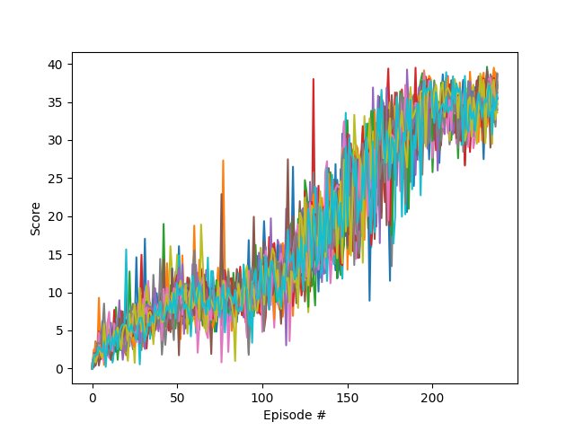

# Project Report

### Introduction

This project implements the [DDPG algorithm](https://arxiv.org/abs/1509.02971) to solve the 20-agent Reacher Unity environment. DDPG is an actor-critic, model-free algorithm based on the deterministic policy gradient that can operate over continuous action spaces. The "Actor" updates the policy distribution in the direction suggested by the Critic (such as with policy gradients), and the "Critic" estimates the value function, which could be the action-value (the Q value) or state-value (the V value). During the learning period, both Actor and Critic have two networks--a local network to update the training parameters, and a target network for evaluation of the performance. To update the local network, a soft update is introduced, which use a fraction $\tau$ of the local network parameters, and $1 - \tau$ of the target parameters to update the target network. ($\tau$ is one of several hyperparameters used in the implementation--see complete list below.) In addition, to allow for exploration of the network, a noise term derived from a Ornstein–Uhlenbeck process is added to the actions.

The implementation borrows code from examples provided in the exercises.

In order to solve the environment, the agents must get an average score of +30 (over 100 consecutive episodes, and over all agents).

### Training the Agent

The agent was trained using Actor-Critic networks with Experience Replay. Both Actor and Critic utilized a neural network with two hidden fully-connected layers having 400 nodes and 300 nodes respectively, interspersed with ReLU activation, and a Batch Normalization layer following the first dense layer.

The network was tuned by reducing MSE loss using the Adam optimizer with a learning rate of 1e-3. Training was carried out in minibatches of size 256.

Here is the complete list of hyperparameters:
```python
BUFFER_SIZE = int(1e6)  # replay buffer size
BATCH_SIZE = 256        # minibatch size
GAMMA = 0.99            # discount factor
TAU = 1e-3              # for soft update of target parameters
LR_ACTOR = 1e-3         # learning rate of the actor
LR_CRITIC = 1e-3        # learning rate of the critic
WEIGHT_DECAY = 0        # L2 weight decay

UPDATE_EVERY = 20       # how often to update the network
UPDATE_TIMES = 10       # how many times to update the network each time

EPSILON = 1.0           # epsilon for the noise process added to the actions
EPSILON_DECAY = 1e-6    # decay for epsilon above
```
### Rewards

The image below plots the rewards per episode obtained by the agent during training. Console logs show that the agents are able to receive an average reward (over 100 episodes) of +30.06 in 239 episodes.



### Improving the Agent

To improve the agent, we can use algorithms like [PPO](https://arxiv.org/pdf/1707.06347.pdf), [A3C](https://arxiv.org/pdf/1602.01783.pdf), and [D4PG](https://openreview.net/pdf?id=SyZipzbCb) that use multiple (non-interacting, parallel) copies of the same agent to distribute the task of gathering experience.  
